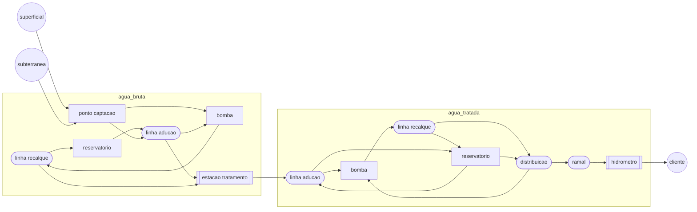

# Water Distribution Data Management (pt_BR)

Water distribution assets.

---

Modelo de dados geoespaciais para sistemas de distribuicao de agua.

### Fluxograma

Exemplo de um fluxo simplificado da "agua", desde a captacao, passando por equipamentos de maioor relevancia, ate o cliente.

### Modelo de dados conceitual

...

### Modelo de dados lógico

```mermaid
erDiagram
	redes_agua }o--|| tipo_rede_agua : references
	redes_agua }o--|| tipo_agua : references
	redes_agua }o--|| tipo_material : references
	redes_agua }o--|| tipo_situacao : references
	captacoes }o--|| setores_abastecimento : references
	captacoes }o--|| tipo_captacao : references
	captacoes }o--|| tipo_manancial : references
	captacoes }o--|| tipo_situacao : references
	conexoes }o--|| tipo_conexao : references
	conexoes }o--|| tipo_material : references
	descargas }o--|| tipo_lancamento : references
	descargas }o--|| tipo_descarga : references
	estacoes_elevatorias }o--|| tipo_agua : references
	estacoes_elevatorias }o--|| tipo_situacao : references
	bombas }o--|| estacoes_elevatorias : references
	bombas }o--|| tipo_bomba : references
	bombas }o--|| tipo_situacao : references
	estacoes_tratamento }o--|| tipo_situacao : references
	hidrantes }o--|| tipo_hidrante : references
	medidores_pressao }o--|| tipo_medidor_pressao : references
	medidores_pressao }o--|| tipo_acesso : references
	medidores_pressao }o--|| tipo_situacao : references
	medidores_vazao }o--|| setores_medicao : references
	medidores_vazao }o--|| tipo_agua : references
	medidores_vazao }o--|| tipo_medidor_vazao : references
	medidores_vazao }o--|| tipo_funcao : references
	medidores_vazao }o--|| tipo_acesso : references
	medidores_vazao }o--|| tipo_situacao : references
	reservatorios }o--|| tipo_reservatorio : references
	reservatorios }o--|| tipo_forma : references
	reservatorios }o--|| tipo_material : references
	reservatorios }o--|| tipo_situacao : references
	tanques_compensacao }o--|| tipo_tanque : references
	tanques_compensacao }o--|| tipo_situacao : references
	valvulas }o--|| tipo_valvula : references
	valvulas }o--|| tipo_funcao_valvula : references
	valvulas }o--|| tipo_acionamento_valvula : references
	valvulas }o--|| tipo_acesso : references
	valvulas }o--|| tipo_posicao_valvula : references

	tipo_rede_agua {
		SMALLINT id
		VARCHAR tipo
	}

	tipo_agua {
		SMALLINT id
		VARCHAR tipo
	}

	tipo_material {
		SMALLINT id
		VARCHAR tipo
	}

	tipo_situacao {
		SMALLINT id
		VARCHAR tipo
	}

	tipo_captacao {
		SMALLINT id
		VARCHAR(255) tipo
	}

	tipo_manancial {
		SMALLINT id
		VARCHAR tipo
	}

	tipo_conexao {
		SMALLINT id
		VARCHAR tipo
	}

	tipo_lancamento {
		SMALLINT id
		VARCHAR tipo
	}

	tipo_descarga {
		SMALLINT id
		VARCHAR tipo
	}

	tipo_bomba {
		SMALLINT id
		VARCHAR tipo
	}

	tipo_nivel_tratamento_agua {
		SMALLINT id
		VARCHAR(255) tipo
	}

	tipo_hidrante {
		SMALLINT id
		VARCHAR(255) tipo
	}

	tipo_medidor_pressao {
		SMALLINT id
		VARCHAR(255) tipo
	}

	tipo_acesso {
		SMALLINT id
		VARCHAR tipo
	}

	tipo_medidor_vazao {
		SMALLINT id
		VARCHAR(255) tipo
	}

	tipo_funcao {
		SMALLINT id
		VARCHAR tipo
	}

	tipo_reservatorio {
		SMALLINT id
		VARCHAR(255) tipo
	}

	tipo_forma {
		SMALLINT id
		VARCHAR tipo
	}

	tipo_tanque {
		SMALLINT id
		VARCHAR(255) tipo
	}

	tipo_valvula {
		SMALLINT id
		VARCHAR tipo
	}

	tipo_funcao_valvula {
		SMALLINT id
		VARCHAR tipo
	}

	tipo_acionamento_valvula {
		SMALLINT id
		VARCHAR tipo
	}

	tipo_posicao_valvula {
		SMALLINT id
		VARCHAR tipo
	}

	redes_agua {
		SERIAL id
		BLOB geom
		SMALLINT tipo
		SMALLINT agua
		SMALLINT material
		INTEGER diametro
		NUMERIC(3) profundidade
		SMALLINT situacao
		VARCHAR(255) localizacao
		VARCHAR(255) observacoes
	}

	setores_abastecimento {
		SERIAL id
		BLOB geom
		VARCHAR(50) nome
		VARCHAR(255) observacoes
	}

	captacoes {
		SERIAL id
		BLOB geom
		INTEGER id_setor_abastecimento
		VARCHAR(50) nome
		SMALLINT tipo
		NUMERIC(6) capacidade
		SMALLINT tipo_manancial
		VARCHAR nome_manancial
		SMALLINT situacao
		VARCHAR(255) localizacao
		VARCHAR(255) observacoes
	}

	conexoes {
		SERIAL id
		BLOB geom
		SMALLINT tipo
		SMALLINT material
		SMALLINT diametro_entrada
		SMALLINT diametro_saida
		NUMERIC(3) profundidade
		VARCHAR(255) localizacao
		VARCHAR(255) observacoes
		NUMERIC rotacao_simbolo
	}

	descargas {
		SERIAL id
		BLOB geom
		SMALLINT tipo
		SMALLINT descarga
		VARCHAR(255) localizacao
		VARCHAR(255) observacoes
	}

	estacoes_elevatorias {
		SERIAL id
		BLOB geom
		VARCHAR(50) nome
		SMALLINT agua
		SMALLINT situacao
		VARCHAR(255) localizacao
		VARCHAR(255) observacoes
	}

	bombas {
		SERIAL id
		BLOB geom
		INTEGER id_estacao_elevatoria
		SMALLINT tipo
		SMALLINT diametro_entrada
		SMALLINT diametro_saida
		NUMERIC(6) vazao
		NUMERIC(6) potencia
		NUMERIC(4) pressao
		SMALLINT situacao
		VARCHAR(255) localizacao
		VARCHAR(255) observacoes
	}

	estacoes_tratamento {
		SERIAL id
		BLOB geom
		VARCHAR(50) nome
		NUMERIC(6) vazao
		SMALLINT tratamento
		SMALLINT situacao
		VARCHAR(255) localizacao
		VARCHAR(255) observacoes
	}

	hidrantes {
		SERIAL id
		BLOB geom
		SMALLINT tipo
		VARCHAR(255) fabricante
		NUMERIC(4) vazao
		VARCHAR(255) localizacao
		VARCHAR(255) observacoes
	}

	medidores_pressao {
		SERIAL id
		BLOB geom
		SMALLINT tipo
		SMALLINT acesso
		SMALLINT situacao
		VARCHAR(255) localizacao
		VARCHAR(255) observacoes
	}

	setores_medicao {
		SERIAL id
		BLOB geom
		VARCHAR(50) nome
		VARCHAR(255) observacoes
	}

	medidores_vazao {
		SERIAL id
		BLOB geom
		INTEGER id_setor_medicao
		SMALLINT agua
		SMALLINT tipo
		SMALLINT funcao
		SMALLINT diametro
		NUMERIC(3) profundidade
		SMALLINT acesso
		SMALLINT situacao
		VARCHAR(255) localizacao
		VARCHAR(255) observacoes
		NUMERIC rotacao_simbolo
	}

	reservatorios {
		SERIAL id
		BLOB geom
		VARCHAR(50) nome
		SMALLINT tipo
		INTEGER volume
		SMALLINT diametro
		NUMERIC(3) altura
		NUMERIC(3) nivel_min
		NUMERIC(3) nivel_max
		NUMERIC(3) altura_base
		SMALLINT forma
		SMALLINT material
		SMALLINT situacao
		VARCHAR(255) localizacao
		VARCHAR(255) observacoes
	}

	tanques_compensacao {
		SERIAL id
		BLOB geom
		SMALLINT tipo
		SMALLINT situacao
		VARCHAR(255) localizacao
		VARCHAR(255) observacoes
	}

	valvulas {
		SERIAL id
		BLOB geom
		SMALLINT tipo
		SMALLINT funcao
		SMALLINT diametro
		SMALLINT acionamento
		SMALLINT acesso
		NUMERIC(3) profundidade
		SMALLINT posicao
		NUMERIC(3) qtd_voltas_fechar
		VARCHAR(255) localizacao
		VARCHAR(255) observacoes
		NUMERIC rotacao_simbolo
	}
```

### Modelo de dados físico

...
