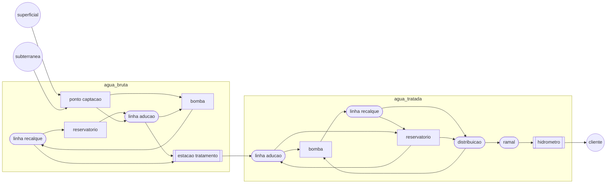

# Water Distribution Data Management (pt_BR)

Water distribution assets.

# Modelo de dados para Sistemas de Agua

Modelo de dados espaciais para sistemas de distribuicao de agua.

## Análise de requisitos

1. Hidrografia/Corpo Receptor
1. Captacoes
    1. Bombas
1. Estacoes Elevatorias
    1. Bombas
1. Redes
    1. Aducao
    1. Recalque
    1. Distribuicao
1. Estacoes Tratamento
1. Reservatorios
1. Ligacoes
    1. Hidrometros/Medidores de vazao
    1. Ramais

### Fluxograma

```mermaid
flowchart LR
    r1(["linha recalque"])
    r2(["linha aducao"])
    cap["ponto captacao"]
    b1[bomba] 
    res1[reservatorio]
    eta[["estacao tratamento"]]
    r3(["linha recalque"])
    r4(["linha aducao"])
    r5([distribuicao])
    b2[bomba]
    res2[reservatorio]
    fim((cliente))
    inicio1((superficial)) --> cap
    inicio2((subterranea)) --> cap
    subgraph agua_bruta
        cap --> b1
        b1 --> r1
        r1 --> res1
        res1 --> r2
        r2 --> b1
        cap --> r2
        r2 --> eta
        r1 --> eta
    end
    eta --> r4
    subgraph agua_tratada
        r4 --> b2
        b2 --> r3
        r3 --> res2
        r3 --> r5
        res2 --> r4
        r4 --> res2
        res2 --> r5
        r5 --> r6
        r5 --> b2
        r6([ramal]) --> hd[[hidrometro]]
    end
    hd --> fim
```

### Modelo de dados conceitual

### Modelo de dados lógico

```mermaid
```

### Modelo de dados físico

```sql
```
