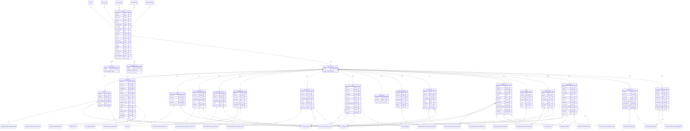

# LOGICAL MODEL

```mermaid
erDiagram

    lifecycle ||--o{ asset: "has"
    asset_owner ||--o{ asset: "has"
    asset_manager ||--o{ asset: "has"
    spatial_source ||--o{ asset: "has"
    spatial_confidence ||--o{ asset: "has"

    asset {
        global_id bigint PK
        object_id integer
        asset_type smallint
        asset_id varchar
        nickname varchar
        lifecycle_status smallint FK
        install_date date
        inservice_date date
        retired_date date
        owned_by smallint FK
        main_by smallint FK
        notes varchar
        spatial_source smallint FK
        spatial_confidence smallint FK
        latitude numeric
        longitude numeric
        altitude numeric
        created_user varchar
        created_date timestamp
        last_edited_user varchar
        last_edited_date timestamp
    }

    asset ||--o| linear_asset: "inherit"
    linear_asset {
        shape geometry(linestringz)
        shape_length numeric
    }

    asset ||--o| polygonal_asset: "inherit"
    polygonal_asset {
        shape geometry(polygonz)
        shape_area numeric
        shape_length numeric
    }

    asset ||--o| punctual_asset: "inherit"
    punctual_asset {
        shape geometry(pointz)
        symbol_rotation smallint
    }

    punctual_asset ||--o| backflow: "inherit"
    backflow {
        object_id serial PK
        asset_id varchar
        asset_type smallint FK
        manufacturer smallint FK
        model bigint
        is_locked smallint FK
    }
    backflow }o--|| asset_type_water_assembly_backflow: "has"
    backflow }o--|| manufactured_types: "has"
    backflow }o--|| yes_no: "use"

    punctual_asset ||--o| fire_hydrant: "inherit"
    fire_hydrant {
        object_id integer PK
        asset_id varchar
        asset_type smallint FK
        manufacturer smallint FK
        model bigint
        diameter smallint FK
        secondary_diameter smallint FK
        last_maint date
        assignmentt_type bigint
        assignment_due date
        assigned_on date
        station varchar
        shift varchar
        adoption_status smallint
        public_view smallint
        adopted_by varchar
        adopted_on date
    }
    fire_hydrant }o--|| asset_type_water_device_fire_hydrant : "is"
    fire_hydrant }o--|| manufactured_types: "has"
    fire_hydrant }o--|| water_diameter : "has"
    fire_hydrant }o--|| fire_hydrant_assignment_type   : "has"
    fire_hydrant }o--|| adoption_status    : "has"
    fire_hydrant }o--|| fire_hydrant_publicview    : "has"

    punctual_asset ||--o| fitting: "inherit"
    fitting {
        object_id integer PK
        asset_id varchar
        asset_type smallint FK
        diameter smallint FK
        secondary_diameter smallint FK
    }
    fitting }o--|| asset_type_water_junction_fitting    : "has"
    fitting }o--|| water_diameter : "has"

    punctual_asset ||--o| flow_valve: "inherit"
    flow_valve {
        object_id integer PK
        asset_id varchar
        asset_type smallint FK
        manufacturer smallint FK
        model bigint
        diameter smallint FK
        last_maint date
    }
    flow_valve }o--|| asset_type_water_device_flow_valve    : "has"
    flow_valve }o--|| manufactured_types    : "has"
    flow_valve }o--|| water_diameter    : "has"

    punctual_asset ||--o| flushing_and_blow_off: "inherit"
    flushing_and_blow_off {
        object_id integer PK
        asset_id varchar
        asset_type smallint FK
        manufacturer smallint FK
        model bigint
        last_maint date
    }
    flushing_and_blow_off }o--|| asset_type_water_device_flushing_and_blow_off    : "has"
    flushing_and_blow_off }o--|| manufactured_types    : "has"

    punctual_asset ||--o| interconnect: "inherit"
    interconnect {
        object_id integer PK
        asset_id varchar
        asset_type smallint FK
        last_maint date
        permitted_flow numeric
        avaible_flow numeric
        emergency smallint
    }
    interconnect }o--|| water_interconnect_connection_type : "has"
    interconnect }o--|| yes_no : "use"

    punctual_asset ||--o| pressure_valve: "inherit"
    pressure_valve {
        object_id integer PK
        asset_id varchar
        asset_type smallint FK
        manufacturer smallint FK
        model bigint
        diameter smallint
        pressure numeric
        last_maint date
    }
    pressure_valve }o--|| asset_type_water_device_pressure_valve : "has"
    pressure_valve }o--|| manufactured_types    : "has"
    pressure_valve }o--|| water_diameter    : "has"

    punctual_asset ||--o| pump: "inherit"
    pump {
        object_id integer PK
        asset_id varchar
        asset_type smallint FK
        manufacturer smallint FK
        model bigint
        last_maint date
        diameter smallint
        secondary_diameter smallint
        pressure numeric
        design_type smallint
        design_info numeric
        operable boolean
    }
    pump }o--|| asset_type_water_device_pump : "has"
    pump }o--|| manufactured_types : "has"
    pump }o--|| water_diameter : "has"
    pump }o--|| water_pump_type : "has"

    punctual_asset ||--o| sample_station: "inherit"
    sample_station {
        object_id integer PK
        last_maint date
        station_location varchar
    }

    punctual_asset ||--o| service_connection: "inherit"
    service_connection {
        object_id serial
        asset_id varchar
        asset_type smallint FK
        last_maint date
        account_id varchar
        critical boolean
        metered boolean
    }
    service_connection }o--|| asset_type_water_device_service_connection : "is"

    punctual_asset ||--o| service_meter: "inherit"
    service_meter {
        object_id serial
        asset_id varchar
        asset_type smallint FK
        manufacturer smallint
        model bigint
        last_maint date
        diameter numeric
        account_id varchar
    }
    service_meter }o--|| asset_type_water_device_service_meter : "is"
    service_meter }o--|| manufactured_types : "has"
    service_meter }o--|| water_diameter : "has"

    punctual_asset ||--o| service_valve: "inherit"
    service_valve {
        object_id serial
        asset_id varchar
        asset_type smallint FK
        manufacturer smallint
        model bigint
        last_maint date
        diameter smallint
        design_type smallint
        valve_status smallint
        clockwise_to_close smallint
        turns_to_close numeric
        operable boolean
        post_indicator_valve boolean
    }
    service_valve }o--|| asset_type_water_device_service_valve : "is"
    service_valve }o--|| manufactured_types : "has"
    service_valve }o--|| water_diameter : "has"
    service_valve }o--|| water_valve_type : "has"
    service_valve }o--|| pipeline_valve_status : "has"
    service_valve }o--|| pipeline_valve_close_direction : "has"

    punctual_asset ||--o| storage: "inherit"
    storage {
        object_id serial
        asset_id varchar
        asset_type smallint FK
        last_maint date
        height numeric
        width numeric
        volume numeric
    }
    storage }o--|| asset_type_water_device_storage : "is"

    punctual_asset ||--o| system_meter: "inherit"
    system_meter {
        object_id serial
        asset_id varchar
        asset_type smallint FK
        manufacturer smallint
        model bigint
        last_maint date
        diameter numeric
    }
    system_meter }o--|| asset_type_water_device_system_meter : "is"
    system_meter }o--|| manufactured_types : "has"
    system_meter }o--|| water_diameter : "has"

    punctual_asset ||--o| system_valve: "inherit"
    system_valve {
        object_id serial
        asset_id varchar
        asset_type smallint FK
        manufacturer smallint
        model bigint
        last_maint date
        diameter smallint
        design_type smallint
        valve_status smallint
        clockwise_to_close smallint
        turns_to_close numeric
        operable boolean
        has_bypass boolean
    }
    system_valve }o--|| asset_type_water_device_system_valve : "is"
    system_valve }o--|| manufactured_types : "has"
    system_valve }o--|| water_diameter : "has"
    system_valve }o--|| water_valve_type : "has"
    system_valve }o--|| pipeline_valve_status : "has"
    system_valve }o--|| pipeline_valve_close_direction : "has"

    punctual_asset ||--o| treatment_plant: "inherit"
    treatment_plant {
        object_id serial
        asset_id varchar
        asset_type smallint FK
        last_maint date
        permitted_capacity numeric
        rated_capacity numeric
        average_daily_flow numeric
        filtration_type smallint
    }
    treatment_plant }o--|| water_treatment_plant_type : "is"
    treatment_plant }o--|| water_supply_filtration_type : "has"

    punctual_asset ||--o| well: "inherit"
    well {
        object_id serial
        asset_id varchar
        asset_type smallint FK
        last_maint date
        filtration_type smallint
        bore_depth numeric
        aquiler_depth numeric
        permitted_flow numeric
        available_flow numeric
    }
    well }o--|| asset_type_water_device_supply_welltype : "is"
    well }o--|| water_supply_filtration_type : "has"

```
