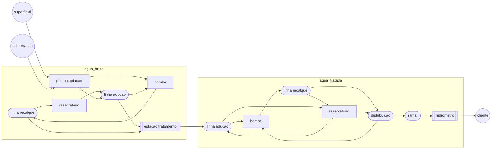

### Fluxograma

Exemplo de um fluxo simplificado da "agua", desde a captacao, passando por equipamentos de maioor relevancia, ate o cliente.

```mermaid
flowchart LR
    r1(["linha recalque"])
    r2(["linha aducao"])
    cap["ponto captacao"]
    b1[bomba]
    res1[reservatorio]
    eta[["estacao tratamento"]]
    r3(["linha recalque"])
    r4(["linha aducao"])
    r5([distribuicao])
    b2[bomba]
    res2[reservatorio]
    fim((cliente))
    inicio1((superficial)) --> cap
    inicio2((subterranea)) --> cap
    subgraph agua_bruta
        cap --> b1
        b1 --> r1
        r1 --> res1
        res1 --> r2
        r2 --> b1
        cap --> r2
        r2 --> eta
        r1 --> eta
    end
    eta --> r4
    subgraph agua_tratada
        r4 --> b2
        b2 --> r3
        r3 --> res2
        r3 --> r5
        res2 --> r4
        r4 --> res2
        res2 --> r5
        r5 --> r6
        r5 --> b2
        r6([ramal]) --> hd[[hidrometro]]
    end
    hd --> fim
```
